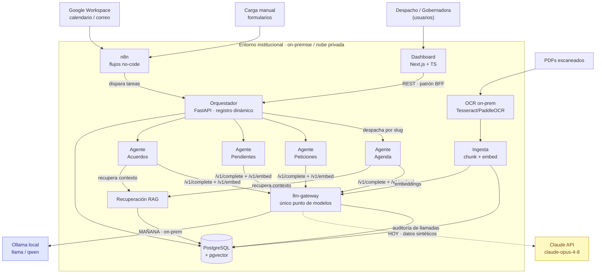
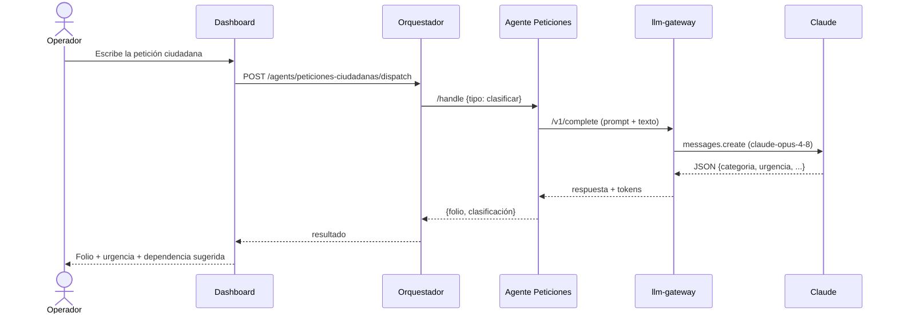
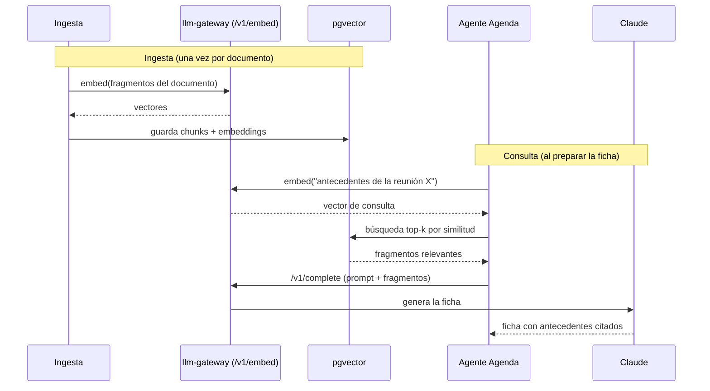
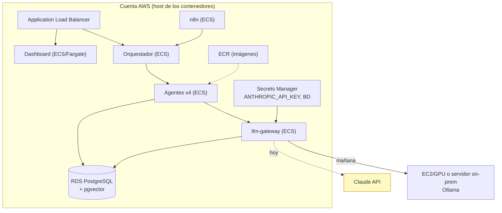

# Arquitectura — diagramas de la solución

Diagramas en Mermaid (se renderizan en GitHub). Pensados para explicar el
sistema a quien se integre al equipo: cómo se comunican los agentes, dónde entra
el RAG, qué está hecho y qué falta.

> Lectura rápida: el **orquestador** reparte trabajo a los **agentes**; los
> agentes piensan a través del **llm-gateway** (único punto de modelos) y
> consultan el **RAG** (pgvector). El **dashboard** presenta todo. **n8n** es la
> capa no-code que dispara flujos. La frontera de **soberanía** separa lo
> on-premise de la API externa de Claude (hoy) → Ollama local (mañana).

---

## 1. Solución completa (visión Fase 1)

**Lo clave para la nueva integrante:**
- Los agentes **nunca** se llaman entre sí ni llaman al modelo directo. Todo pasa
  por el **orquestador** (coordinación) y el **gateway** (modelos). Eso permite
  sumar agentes sin rediseñar (4 → 10).
- El **RAG no es una herramienta no-code**: es parte del núcleo IA. Vive sobre
  **pgvector** (la misma BD), y los embeddings se calculan **on-prem** en el
  gateway. Por eso el corpus documental no sale del entorno.
- **n8n es la capa no-code** y alimenta al sistema (intake de formularios,
  Google Workspace, disparadores por tiempo); **no reemplaza a los agentes**.

---

## 2. Estado actual — qué tenemos vs qué falta

```mermaid
flowchart TB
    DASH["Dashboard: Resumen + Peticiones"]:::ok
    ORCH["Orquestador: registro + dispatch"]:::ok
    GW["llm-gateway: proveedor Claude /v1/complete"]:::ok
    A2["Agente Peticiones (completo)"]:::ok
    A134["Agentes Agenda/Pendientes/Acuerdos (stubs)"]:::ok
    PG[("Postgres: esquema 10 agentes + seed")]:::ok
    TESTS["Pruebas unitarias + evals de los 4 agentes"]:::ok

    EMBED["/v1/embed + RAG (recuperación)"]:::falta
    INGEST["Ingesta + chunking"]:::falta
    OCRR["OCR real (Tesseract/PaddleOCR)"]:::falta
    N8NF["Flujos n8n (intake, Google, semáforos)"]:::falta
    GAUTH["Auth RBAC en el tablero"]:::falta
    AUDIT["Persistir llm_audit en BD"]:::falta
    PROD["Despliegue a producción (AWS)"]:::falta
    OLL["Migración a Ollama"]:::falta

    classDef ok fill:#d1fae5,stroke:#10b981,color:#064e3b;
    classDef falta fill:#fee2e2,stroke:#ef4444,stroke-dasharray:4 4,color:#7f1d1d;
```

🟩 verde = hecho y verificado · 🟥 rojo punteado = pendiente.

---

## 3. Flujo que YA funciona — clasificar una petición

---

## 4. Flujo que FALTA — ficha de reunión con RAG

---

## 5. Despliegue en producción (AWS)

Ver `docs/produccion.md` para el detalle. Resumen visual:

> **La arquitectura es cloud-agnóstica:** los mismos contenedores corren en un
> EC2 con `docker compose` (rápido) o en ECS/Fargate (escalable). AWS es el
> *dónde*, no cambia el *qué*. La frontera de soberanía (ADR-001/002) se respeta
> igual: con datos reales, el `llm-gateway` apunta a Ollama y el corpus RAG
> permanece en la BD.
