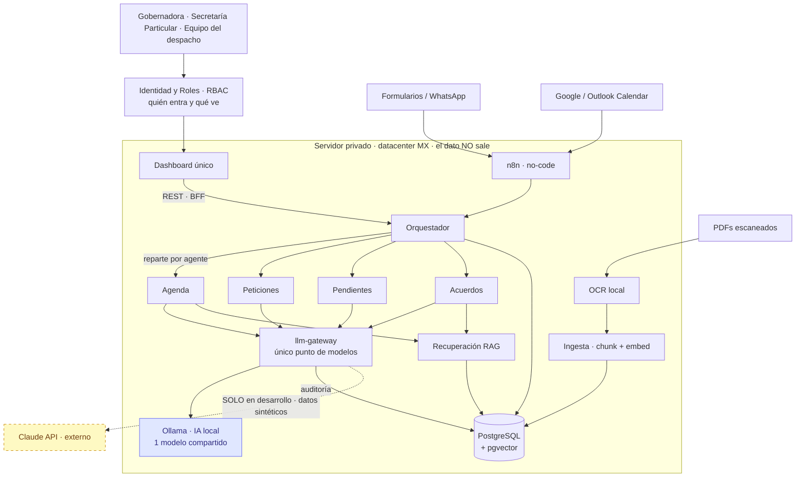
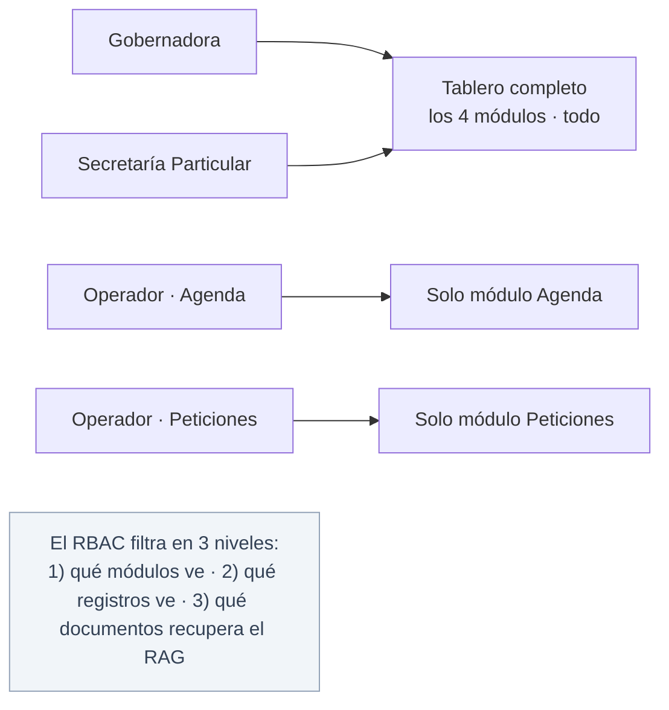
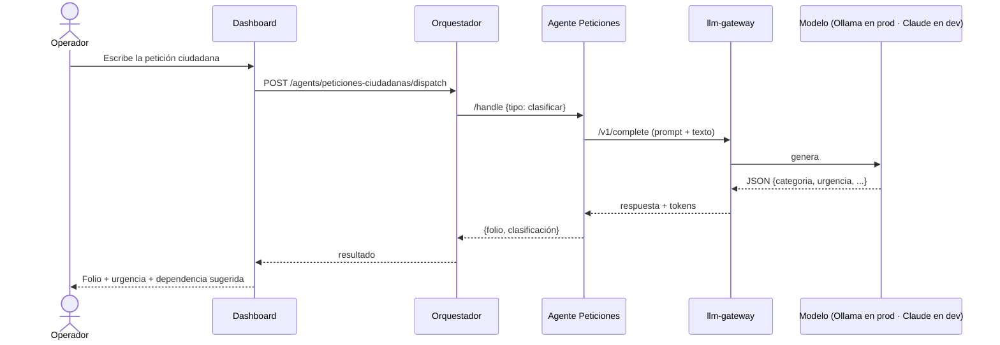
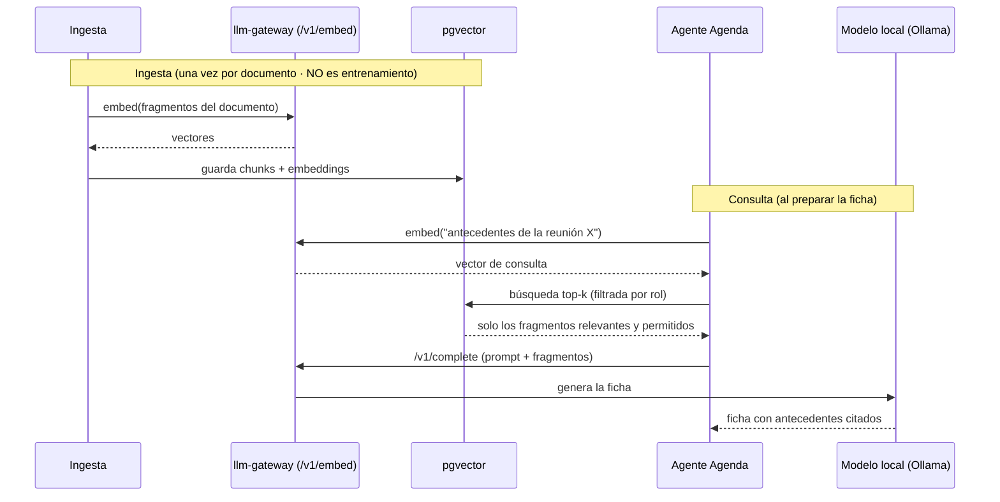
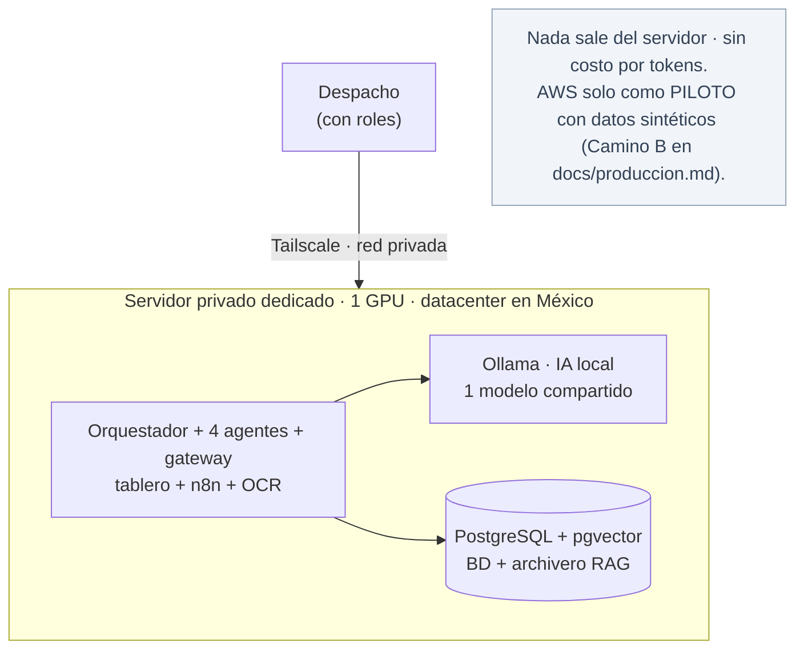

# Arquitectura — diagramas de la solución

Diagramas en Mermaid (se renderizan en GitHub). Pensados para explicar el
sistema a quien se integre al equipo: cómo se comunican los agentes, dónde entra
el RAG, cómo entran los roles, qué está hecho y qué falta.

> **TL;DR.** En **producción** todo corre en un **servidor privado con IA local
> (Ollama)** y el dato **no sale**. **Claude se usa solo en desarrollo** con datos
> sintéticos. Los usuarios entran por el **tablero**, filtrados por **roles
> (RBAC)**. El **orquestador** reparte trabajo a los **agentes**; los agentes
> piensan vía el **llm-gateway** (único punto de modelos) y consultan el **RAG**
> (recuperación sobre pgvector). **n8n** es la capa no-code que alimenta el
> sistema. **El RAG no entrena el modelo**: busca y entrega fragmentos en el
> momento de cada pregunta.

**Leyenda:** 🟦 IA local (Ollama) · 🟨 externo, solo desarrollo (Claude) ·
🟩 hecho · 🟥 pendiente · ⬛ datos (pgvector).

---

## 1. Solución completa (producción: IA local + roles)

**Claves:**
- El cerebro de producción es **Ollama local** (azul). **Claude** (amarillo
  punteado) es **solo desarrollo**: no forma parte de lo entregado.
- **Una sola** instalación de Ollama, **compartida** por los 4 agentes (y los 10
  después) a través del gateway. No es una por agente.
- Entre los usuarios y el tablero hay un **filtro de roles (RBAC)**.

---

## 2. Estado actual — qué tenemos vs qué falta

```mermaid
flowchart TB
    DASH["Dashboard: Resumen + Peticiones"]:::ok
    ORCH["Orquestador: registro + dispatch"]:::ok
    GW["llm-gateway: proveedor pluggable (Claude hoy)"]:::ok
    A2["Agente Peticiones (completo)"]:::ok
    A134["Agentes Agenda/Pendientes/Acuerdos (stubs)"]:::ok
    PG[("Postgres: esquema 10 agentes + seed")]:::ok
    TESTS["Pruebas + evals de los 4 agentes"]:::ok

    ROLES["Roles / RBAC activos (login + permisos)"]:::falta
    OLL["Ollama local + validación de los agentes"]:::falta
    EMBED["/v1/embed + RAG (recuperación)"]:::falta
    INGEST["Ingesta + chunking + OCR real"]:::falta
    N8NF["n8n: formularios, WhatsApp, Google/Outlook, semáforos"]:::falta
    AUDIT["Persistir auditoría llm_audit"]:::falta
    PROD["Despliegue en servidor privado"]:::falta

    classDef ok fill:#d1fae5,stroke:#10b981,color:#064e3b;
    classDef falta fill:#fee2e2,stroke:#ef4444,stroke-dasharray:4 4,color:#7f1d1d;
```

🟩 hecho y verificado · 🟥 pendiente.

---

## 3. Roles — quién ve qué (RBAC)

> **No todo va para todos.** La Gobernadora y Secretaría Particular ven todo;
> los operadores ven solo su módulo. El RBAC también **filtra el RAG**: cada rol
> recupera únicamente documentos permitidos. Las tablas ya existen en la BD
> (`usuarios`, `roles`, `permisos`); falta activarlas (no es rediseño).

---

## 4. Flujo que YA funciona — clasificar una petición

> El flujo es idéntico en desarrollo y producción; **solo cambia el cerebro**
> detrás del gateway (Claude → Ollama).

---

## 5. Flujo del RAG — ficha de reunión (no entrena, recupera)

---

## 6. Despliegue en producción — nube privada + IA local

> **Un** servidor, **un** Ollama, **una** BD. Los 4 agentes comparten todo eso;
> crecer a 10 = más capacidad en el mismo servidor, no más cerebros.
> La frontera de soberanía se cumple: en producción el cómputo de IA es **local**.
